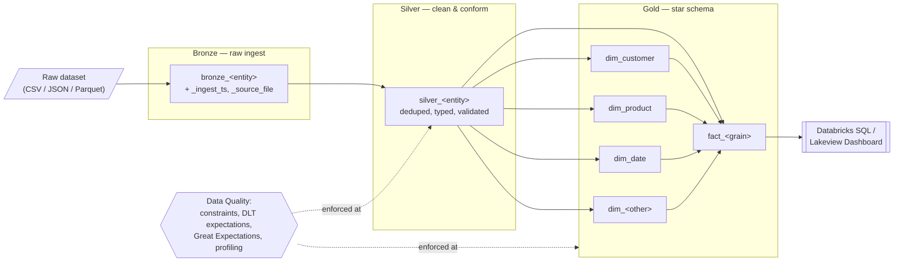

# Academy Project Brief

## 1. Overview

Your team has been hired as the founding data engineering squad for a growing
business that has been running "on spreadsheets" for too long. Leadership has
handed you a **raw operational dataset** (supplied by your instructor) and asked
for one thing: turn it into a trustworthy, query-ready analytics platform that
the business can actually make decisions from. Over this project you will build
a complete **Databricks Lakehouse** solution — ingesting the raw data into a
**Bronze** layer, cleaning and conforming it through **Silver**, modelling a
**star schema** in **Gold**, enforcing **data quality** at every hop, and
publishing a **dashboard** that answers real business questions. Optionally, you
will layer on machine learning, GenAI, streaming, or CI/CD hardening to lift
your grade. The goal is a single, coherent, end-to-end pipeline that
demonstrates everything you learned across the program.

## 2. Learning Objectives

By completing this project you will demonstrate that you can:

- Set up a Databricks workspace, catalog/schema, and Delta tables, and code
  fluently across Python and SQL — *Day 1 (`day_1_modern_data_architecture/`)*.
- Build a medallion pipeline with PySpark and Delta Live Tables, including
  simulated/continuous ingestion — *Day 2
  (`day_2_data_processing_with_pyspark_and_delta_live/`)*.
- Design and implement a Kimball-style star schema (facts, conformed dimensions,
  grain, surrogate keys) and orchestrate it as a Job — *Day 3
  (`day_3_data_modelling_essentials/`)*.
- Apply software-engineering discipline, row-level security, and secret scanning
  to your pipeline — *Day 4 (`day_4_architecture_deep_security_dive_ci_cd/`)*.
- Enforce data quality with Delta constraints, DLT expectations, Great
  Expectations, and data profiling/drift detection — *Day 5
  (`day_5_data_quality_and_observability/`)*.
- (Optional) Add a Structured Streaming ingestion path — *Day 6
  (`day_6_streaming_data_engineering/`)*.
- (Optional) Train and track a model with MLflow — *Day 7
  (`day_7_ml_foundations_and_mlflow/`)*.
- (Optional) Add embeddings/RAG or an agent over your curated data — *Day 8
  (`day_8_generative_ai_rag_and_agents_on_databricks/`)* and *Genie labs
  (`databricks_genie_labs/`)*.
- Build dashboards and think about observability and cost — *Day 9
  (`day_9_dashboarding_observability_and_finops/`)*.
- (Optional) Harden with CI/CD and MLOps practices — *Day 10
  (`day_10_ml_ops_ci_cd_and_secure_ai_operations/`)*.

## 3. The Dataset

Your instructor will supply a **raw dataset** at the start of the project. It may
arrive as CSV, JSON, or Parquet files, or as a Databricks sample dataset. Treat
whatever you receive as the **untrusted source of truth** — do not assume it is
clean.

Before writing code, agree as a team on the following and record it in your
README:

- **Entities** — What real-world things does the data describe (e.g. orders,
  customers, products, events, patients)?
- **Grain** — What does one row in the *primary* table represent? This drives
  your fact-table grain later.
- **Time column** — Which column represents the event/transaction time? You need
  this for incremental loads, partitioning, and time-based analysis.
- **Natural keys** — Which column(s) uniquely identify a business entity? You
  will generate **surrogate keys** from these.
- **Measures vs. attributes** — Which numeric columns are additive facts
  (amounts, quantities) versus descriptive attributes (names, categories)?

> **Worked Example (swap for your own dataset)**
>
> Suppose the instructor supplies the **Olist Brazilian e-commerce** files (the
> same family used across `day_2`, `day_3`, and `databricks_genie_labs/`):
> `olist_orders`, `olist_order_items`, `olist_products`, `olist_customers`,
> `olist_sellers`, `olist_order_reviews`.
>
> - **Entities:** orders, order items, products, customers, sellers.
> - **Grain (primary fact):** one row per **order item** (an order can contain
>   several items).
> - **Time column:** `order_purchase_timestamp`.
> - **Natural keys:** `order_id`, `product_id`, `customer_id`, `seller_id`.
> - **Measures:** `price`, `freight_value`; derived `revenue = price + freight`.
> - **Attributes:** product category, customer city/state, review score.
>
> If your dataset is, say, IoT telemetry or FHIR medical records (see
> `day_6_streaming_data_engineering/Stretch Goal FHIR Data Analytics.py`),
> re-map these fields accordingly — the *shape* of the solution stays the same.

## 4. Architecture

You will implement a classic **medallion architecture** on Delta Lake. Raw data
lands in **Bronze** with full fidelity plus ingestion metadata; **Silver**
cleans, conforms, deduplicates, and joins; **Gold** exposes a **star schema** of
facts and dimensions for analytics and dashboards.

**Target objects at each layer:**

| Layer | Object naming | Type | Purpose |
|-------|---------------|------|---------|
| Bronze | `bronze_<entity>` | Delta table (streaming/batch) | Raw rows + ingestion metadata |
| Silver | `silver_<entity>` | Delta / DLT table | Cleaned, typed, deduplicated, conformed |
| Gold | `fact_<grain>`, `dim_<name>` | Delta / DLT table | Star schema for analytics |

Use **Delta Live Tables** (`@dlt.table`) where a declarative, dependency-managed
pipeline helps — as demonstrated in
`day_2_data_processing_with_pyspark_and_delta_live/01_DLT_Pipeline.py`.

## 5. Functional Requirements

All requirements are **testable**. Each group member should be able to
demonstrate the outcome live.

### 5.1 Ingestion & Bronze

1. Ingest the supplied raw dataset into one or more `bronze_<entity>` Delta
   tables with **minimal transformation** (no filtering of business rows).
2. Preserve raw fidelity: keep all source columns; do not drop or rename source
   fields at this stage.
3. Capture **ingestion metadata** on every Bronze row — at minimum an
   `_ingest_timestamp` (`current_timestamp()`) and a `_source_file` / source
   identifier. See the simulation patterns in
   `day_2_data_processing_with_pyspark_and_delta_live/02_Data_Simulator.py`.
4. Bronze ingestion must be **re-runnable** without duplicating or corrupting
   data (idempotent append or merge).

### 5.2 Silver (clean / conform)

5. Produce `silver_<entity>` tables that: cast columns to correct types, trim/
   standardise strings, and handle nulls explicitly.
6. **Deduplicate** to the correct grain using window functions (keep latest by
   timestamp per natural key) — the technique from
   `day_1_modern_data_architecture/lab1_intro_to_coding_in_databricks.py` and
   `day_3_data_modelling_essentials/olist_order_reviews_dataset_code_fix.ipynb`.
7. **Conform** shared entities (e.g. consistent category/location spellings) and
   join related sources so Silver is analysis-ready.
8. Document each transformation (a short comment or markdown cell per step).

### 5.3 Gold & Star Schema

9. Design a **star schema**: identify the fact table(s), define the **grain**
   in one sentence, and identify **conformed dimensions**. Follow the Kimball
   approach from `day_3_data_modelling_essentials/01_StarSchemaDesign.py`.
10. Generate **surrogate keys** for each dimension and reference them from the
    fact table (do not join facts to dimensions on natural keys at query time).
11. Build a **`dim_date`** (or equivalent time dimension) derived from your time
    column.
12. Materialise `fact_<grain>` and `dim_<name>` as Gold Delta tables, with
    additive **measures** on the fact and descriptive **attributes** on the
    dimensions.
13. Provide a **star-schema diagram** (Mermaid ER diagram) in your README.

### 5.4 Data Quality & Observability

14. Apply at least **two Delta constraints** on Silver/Gold tables — e.g.
    `NOT NULL` and a `CHECK` — as shown in
    `day_5_data_quality_and_observability/01_constraints.py`.
15. Apply **DLT expectations** covering all three enforcement behaviours across
    your pipeline:
    - `@dlt.expect` (monitor only),
    - `@dlt.expect_or_drop` (drop bad rows),
    - `@dlt.expect_or_fail` (fail the pipeline on critical violations).
    Reference: `03_dlt_expectations_demo_expect_all.py`,
    `04_dlt_expectations_expect_all_or_drop.py`,
    `05_dlt_expectations_expect_or_fail.py`.
16. Add **one Great Expectations** validation suite **or** a **Databricks data
    profiling** step, with drift/quality output — see
    `06_great_expectations_lab.py` and `07_databricks_data_profiling.py`.
17. Clearly define **handling of failing records** (quarantine table, dropped, or
    flagged) and produce a short **data-quality report** (counts of passed/
    dropped/quarantined rows per rule).

### 5.5 Dashboard & Visualisation

18. Define **at least three business questions** your stakeholders care about
    (e.g. revenue by category over time, top customers by region, on-time rate).
19. Build a **Databricks SQL / Lakeview dashboard** with at least **four
    visualisations** that answer those questions, querying the **Gold star
    schema** (not Bronze/Silver).
20. Each visualisation must be backed by a saved query that joins the fact to at
    least one dimension via surrogate keys.

## 6. Optional / Stretch Features

Pick **at least one** for a higher grade. Doing more than one earns additional
extra credit (see rubric).

- **ML component (Day 7).** Train and evaluate a model against your Gold tables
  (e.g. demand forecasting, churn/classification, review-score prediction).
  Track parameters, metrics, and the model with **MLflow**; register the best
  run. Reference `day_7_ml_foundations_and_mlflow/mlflow_beginner_tutorial_with_exercises.py`.
- **GenAI / RAG / Agent (Day 8 + Genie labs).** Generate **embeddings** over a
  text column and build a small retrieval or similarity feature, or configure a
  **Genie agent** over your Gold schema with General Instructions and Trusted
  Examples. Reference
  `day_8_generative_ai_rag_and_agents_on_databricks/embeddings_tutorial_databricks.py`
  and `databricks_genie_labs/Lab_Build_a_Genie_Agent.sql`.
- **Streaming ingestion path (Day 6).** Add a Structured Streaming producer that
  feeds Bronze incrementally, with a streaming aggregation feeding a live tile.
  Reference `day_6_streaming_data_engineering/Streaming Data (Streaming Producer).py`.
- **CI/CD, orchestration & FinOps hardening (Days 4, 9, 10).** Chain the
  pipeline as a **Databricks Job** (see
  `day_3_data_modelling_essentials/04_Creating_A_Job.sql`), add **secret
  scanning** (Gitleaks) and **pytest** unit tests for transformations (Day 4),
  and add cost/observability notes (Day 9). Reference
  `day_4_architecture_deep_security_dive_ci_cd/day_4_software_engineering_security_students.py`.

## 7. Deliverables

Each group submits:

1. **A Git repository / Databricks Repo** containing all notebooks (`.py`/
   `.sql`/`.ipynb`) organised by medallion layer, with a clear folder structure.
2. **A runnable DLT pipeline** (or documented Job) that builds Bronze → Silver →
   Gold end to end from the raw dataset.
3. **A published dashboard** (Databricks SQL / Lakeview) — include the link and a
   screenshot in the README.
4. **A star-schema diagram** (Mermaid ER diagram) with grain, keys, and
   relationships labelled.
5. **A data-quality report** summarising rules applied and pass/drop/quarantine
   counts.
6. **A README** covering: dataset assumptions, architecture, how to run,
   business questions answered, and which stretch feature(s) you attempted.
7. **A short demo** (10–15 minutes) walking through the pipeline live and
   answering questions.

## 8. Suggested Timeline / Milestones

| Milestone | Focus | Output |
|-----------|-------|--------|
| M1 — Setup & Bronze | Workspace, catalog/schema, load raw data | `bronze_*` tables with ingestion metadata |
| M2 — Silver | Clean, type, dedupe, conform, join | `silver_*` tables + transformation notes |
| M3 — Star schema | Design + build facts & dimensions, surrogate keys | `fact_*`, `dim_*`, ER diagram |
| M4 — Data quality | Constraints, DLT expectations, GE/profiling | DQ rules wired in + quality report |
| M5 — Dashboard | Business questions, saved queries, tiles | Published dashboard |
| M6 — Stretch + polish | Optional ML/GenAI/streaming/CICD, README, rehearse demo | Final repo + demo |

Adjust pacing to your program schedule; M1–M5 are the non-negotiable core.

## 9. Constraints & Ground Rules

- **Platform:** everything runs on **Databricks** — Delta Lake, Delta Live
  Tables, Databricks SQL / Lakeview dashboards, MLflow, and Unity Catalog where
  available.
- **Allowed tools:** PySpark, Spark SQL, DLT, Great Expectations, MLflow,
  LangChain/`ChatDatabricks` and Genie (for stretch), pytest, Gitleaks.
- **Isolation:** create your own catalog/schema (or user-scoped schema) so teams
  do not collide — follow the setup pattern in
  `day_2_data_processing_with_pyspark_and_delta_live/00_LabSetup.py`.
- **Security:** no hardcoded secrets or credentials in notebooks or Git; run a
  secret scan before submitting (Day 4).
- **Naming conventions:** prefix tables by layer (`bronze_`, `silver_`,
  `fact_`, `dim_`); use `snake_case`; keep one entity per Silver table.
- **Teamwork:** every member owns and can demo at least one layer/feature; use a
  shared Git branch-per-feature workflow (Day 1).
- **Out of scope:** production infra provisioning, non-Databricks orchestrators,
  and any dataset not supplied/approved by the instructor.

## 10. Getting Started Checklist

1. Confirm you can access the Databricks workspace and start/attach a cluster.
2. Create your team **catalog and schema** (or user-scoped schema) and a
   **volume** for raw files (pattern: `00_LabSetup.py` from Day 2).
3. Obtain the **raw dataset** from your instructor and upload it to the volume.
4. As a team, fill in the **dataset assumptions** from Section 3 (grain, time
   column, keys, measures) in your README.
5. Create your first **`bronze_<entity>`** table by loading the raw files and
   adding `_ingest_timestamp` and `_source_file`.
6. Verify the Bronze row count matches the source, then commit to Git and move
   on to Silver.

## 11. Hints & Common Pitfalls

- **Wrong grain sinks the star.** Nail the fact grain before building anything in
  Gold — revisit `day_3_data_modelling_essentials/01_StarSchemaDesign.py`.
- **Deduplicate deliberately.** Use window functions (`row_number()` over natural
  key ordered by timestamp) rather than blind `distinct` — see
  `day_3_data_modelling_essentials/olist_order_reviews_dataset_code_fix.ipynb`.
- **Join facts to dims on surrogate keys**, not natural keys, or your dashboard
  queries will be slow and ambiguous.
- **Pick the right expectation.** Use `expect` to observe, `expect_or_drop` to
  clean, and `expect_or_fail` only for truly critical rules — over-using
  `expect_or_fail` will make your pipeline brittle
  (`day_5_data_quality_and_observability/`).
- **Bronze stays raw.** Resist the urge to clean in Bronze; every transformation
  belongs in Silver so you can always replay from raw.
- **Idempotency matters.** Re-running ingestion should not double your data —
  test a second run early (`day_2_.../02_Data_Simulator.py`).
- **Dashboard from Gold only.** If a tile queries Bronze or Silver, you have a
  modelling gap to fix.
- **Scan for secrets before you push.** A single hardcoded token fails the
  engineering gate (Day 4).
