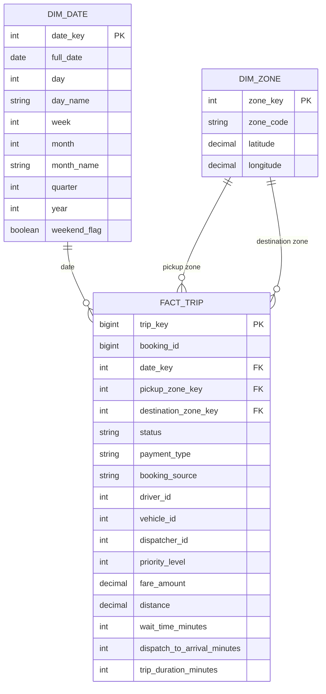

```mermaid
erDiagram

    FACT_TRIP {

        bigint trip_key PK
        bigint booking_id

        int date_key FK
        int pickup_zone_key FK
        int destination_zone_key FK

        string status
        string payment_type
        string booking_source

        int driver_id
        int vehicle_id
        int dispatcher_id

        int priority_level

        decimal fare_amount
        decimal distance

        int wait_time_minutes
        int dispatch_to_arrival_minutes
        int trip_duration_minutes
    }

    DIM_DATE {

        int date_key PK

        date full_date

        int day
        string day_name

        int week

        int month
        string month_name

        int quarter

        int year

        boolean weekend_flag
    }

    DIM_ZONE {

        int zone_key PK

        string zone_code

        decimal latitude
        decimal longitude
    }

    DIM_DATE ||--o{ FACT_TRIP : "date"

    DIM_ZONE ||--o{ FACT_TRIP : "pickup zone"

    DIM_ZONE ||--o{ FACT_TRIP : "destination zone"

```